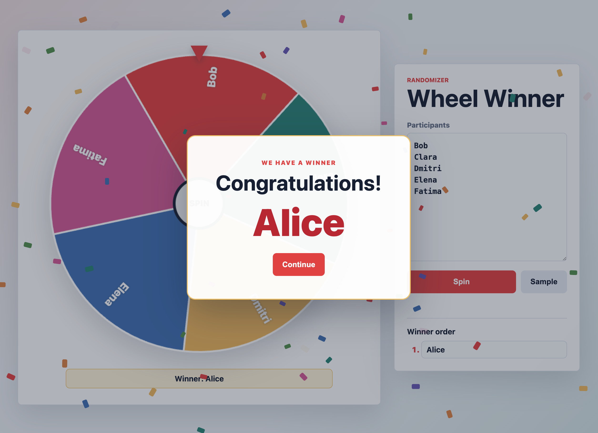

# Randomizer Wheel



One-page wheel UI with a FastAPI backend for selecting a random winner from a submitted participant list.

## Project Structure

```text
randomizer-wheel/
├── .github/
│   ├── actions/
│   │   └── coverage-report/
│   │       ├── action.yml
│   │       └── report_coverage.py
│   ├── codex/
│   │   ├── review-config.toml
│   │   ├── prompts/
│   │   │   └── review.md
│   │   └── tests/
│   │       └── review.test.mjs
│   └── workflows/
│       ├── ai-review.yml
│       ├── ci.yml
│       └── deployment.yml
├── backend/
│   ├── app/
│   │   ├── __init__.py
│   │   ├── main.py
│   │   ├── randomizer.py
│   │   └── schemas.py
│   ├── tests/
│   │   ├── test_api.py
│   │   └── test_randomizer.py
│   ├── pyproject.toml
│   └── uv.lock
├── docs/
│   ├── ai-review.md
│   ├── deployment-setup.md
│   └── deployment.md
├── frontend/
│   ├── app.js
│   ├── index.html
│   └── styles.css
├── infra/
│   ├── application/
│   │   ├── .terraform.lock.hcl
│   │   ├── main.tf
│   │   ├── outputs.tf
│   │   ├── variables.tf
│   │   └── versions.tf
│   ├── bootstrap/
│   │   ├── .terraform.lock.hcl
│   │   ├── main.tf
│   │   ├── outputs.tf
│   │   ├── terraform.tfvars.example
│   │   ├── variables.tf
│   │   └── versions.tf
│   └── foundation/
│       ├── .terraform.lock.hcl
│       ├── main.tf
│       ├── outputs.tf
│       ├── variables.tf
│       └── versions.tf
├── Dockerfile
├── .dockerignore
├── justfile
├── README.md
└── .gitignore
```

## Requirements

- Python 3.13+
- `uv`

For container workflows:

- Docker
- `just`

## Backend Setup

```bash
cd backend
UV_CACHE_DIR=.uv-cache uv sync --dev
```

## Run The Application

```bash
cd backend
UV_CACHE_DIR=.uv-cache uv run uvicorn app.main:app --reload
```

Open the frontend at `http://127.0.0.1:8000/`.
The API is served under `http://127.0.0.1:8000/api`.

## Docker

Build the image from the repository root:

```bash
just build
```

Run the container on local port `8080`:

```bash
just run
```

Inspect the image metadata:

```bash
just inspect
```

Smoke-test the running container:

```bash
just smoke
```

Override defaults when needed:

```bash
just port=9090 run
just port=9090 smoke
```

## Endpoints

### `GET /health`

Example response:

```json
{
  "status": "ok"
}
```

### `POST /api/pick-winner`

Request body:

```json
{
  "participants": ["Alice", "Bob", "Clara"]
}
```

Example response:

```json
{
  "winner": "Bob",
  "winner_index": 1,
  "participants": ["Alice", "Bob", "Clara"]
}
```

Notes:

- `participants` must contain at least one item.
- Participant names must be non-empty strings.
- The winner is selected randomly on each request.

## Run Tests

```bash
cd backend
UV_CACHE_DIR=.uv-cache uv run pytest
```

## Codex Pull Request Reviews

The independent [AI Review workflow](.github/workflows/ai-review.yml) reviews
same-repository pull requests to `main` when opened, updated, or reopened.
Codex returns findings using the review prompt, and a separate job posts the
result as a PR comment. Fork and Dependabot PRs are skipped. Tests, coverage,
and Terraform validation remain in `CI`.

Follow the [AI review setup guide](docs/ai-review.md) to configure
`OPENAI_API_KEY` and `CONTEXT7_API_KEY`. The guide explains the trusted
configuration, sandbox, and review limitations.

## Deployment

Production infrastructure is managed with Terraform and deployed to Google
Cloud Run from GitHub Actions. See [Deployment Architecture](docs/deployment.md)
and [Deployment Setup](docs/deployment-setup.md).
